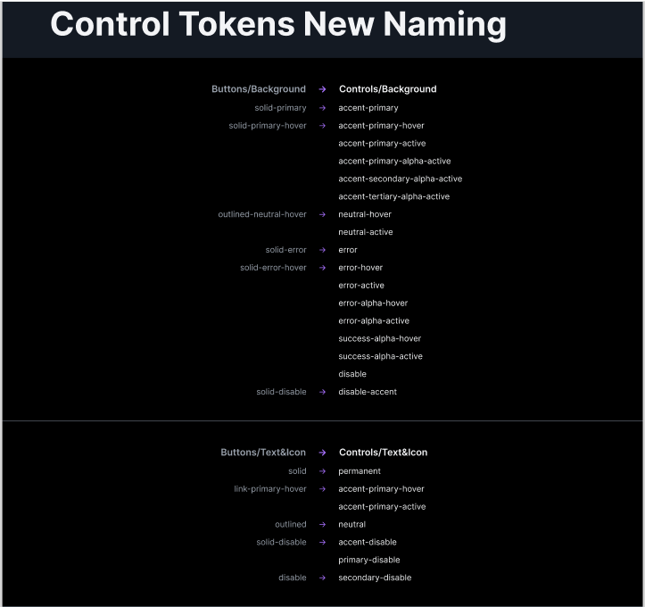

# Ai Dial Themes Change Log
## 0.14.0

### Added

- `stroke-focus`

- New button background tokens:
  - `controls-bg-accent-primary-active`
  - `controls-bg-accent-primary-alpha-active`
  - `controls-bg-accent-secondary-alpha-active`
  - `controls-bg-accent-tertiary-alpha-active`
  - `controls-bg-error-active`
  - `controls-bg-error-alpha-hover`
  - `controls-bg-error-alpha-active`
  - `controls-bg-neutral-active`
  - `controls-bg-accent-success-alpha-hover`
  - `controls-bg-accent-success-alpha-active`

- New button text tokens:
  - `controls-text-accent-primary-active`
  - `controls-text-secondary-disable`
  - `controls-text-accent-disable`

---

### Renamed

- `controls-bg-solid-primary` → `controls-bg-accent-primary`
- `controls-bg-solid-primary-hover` → `controls-bg-accent-primary-hover`
- `controls-bg-solid-error` → `controls-bg-error`
- `controls-bg-solid-error-hover` → `controls-bg-accent-error-hover`
- `controls-bg-solid-disable` → `controls-bg-disable-accent`
- `controls-bg-outlined-neutral-hover` → `controls-bg-neutral-hover`
- `controls-text-solid` → `controls-text-permanent`
- `controls-text-solid-disable` → `controls-text-primary-disable`
- `controls-text-outlined` → `controls-text-neutral`
- `controls-text-link-primary-hover` → `controls-text-accent-primary-hover`

## 0.13.0

### Added

- Introduced new token:
  - `text-warning-icon`

- New solid button background tokens:
  - `controls-bg-solid-primary`
  - `controls-bg-solid-primary-hover`
  - `controls-bg-solid-error`
  - `controls-bg-solid-error-hover`
  - `controls-bg-solid-disable`

- New outlined button state token:
  - `controls-bg-outlined-neutral-hover`

- New button text tokens:
  - `controls-text-solid`
  - `controls-text-solid-disable`
  - `controls-text-outlined`
  - `controls-text-link-primary-hover`

---

### Removed

- Deprecated token:
  - `bg-model-icon`
